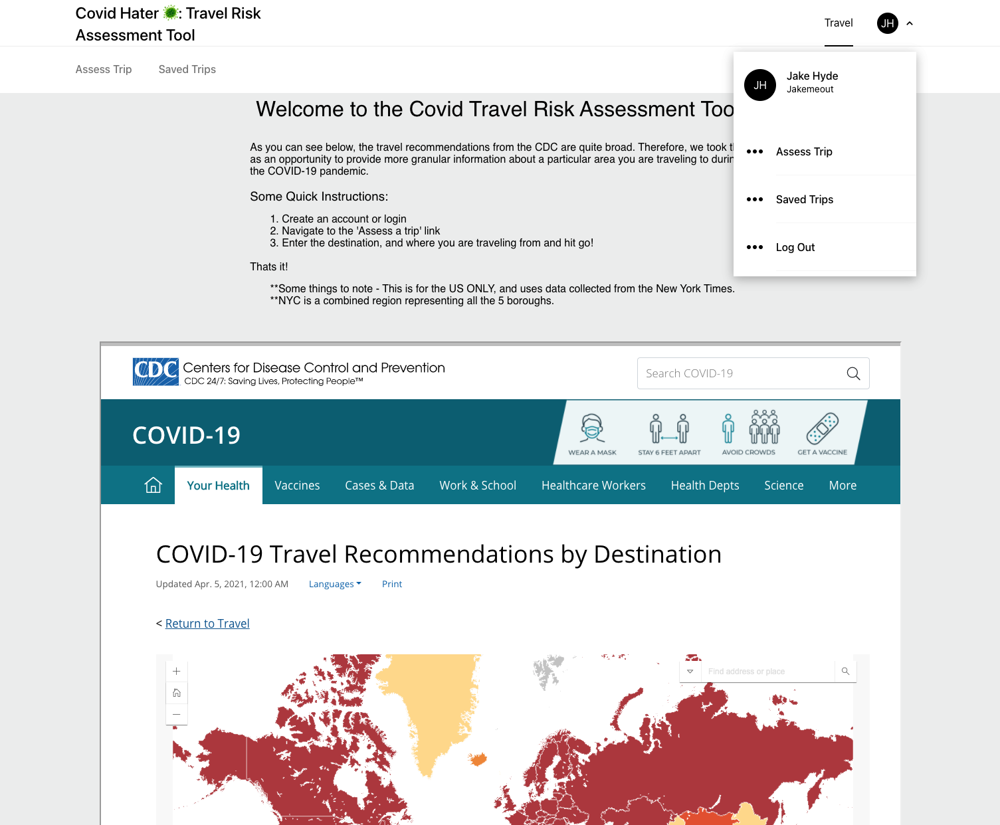

# Covid-Assessment-Tool
The COVID Assessment Tool is a tool that allows users to get directions from a starting point to a destination and gives COVID infection data, local state and county contact/news information, as well as an overall assessment of the destinations risk. COVID assessment tool uses realtime scraped NYT COVID data on the County level, as well as Texas's repoening strategy as a guide for our assessment determinations.

Signup and try out the app here: [COVID-Assessment-Tool](https://covid-travel-frontend.herokuapp.com/)

# The Stack 
This application utilizes Ruby, Ruby on Rails, JavaScriptReact, Redux, Baseweb, Google Maps API, Autocomplete, and Google React components. 

# Local Setup Guide
NOTE: If you do not have postgresql installed, please install it with homebrew https://www.postgresql.org/download/macosx/. Another resource to summarize this installation is here https://flaviocopes.com/postgres-how-to-install/.

1. Fork and clone this repo `git clone git@github.com:jakemeout/Covid-Assessment-Tool.git`
1. Navigate to the api folder and run `bundle install`
1. Run the following commands to create and migrate the Postgres database
```
rails db:create
rails db:migrate
rails s // To run the local server
```
1. Navigate to the frontend folder and run `npm install`
1. Run `npm start` to run the local server


# ScreenShots
